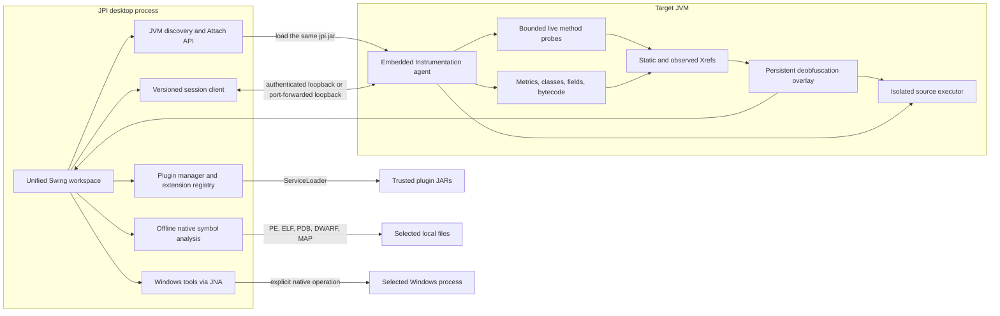

<p align="center">
  
</p>

<h1 align="center">Java Process Inspector</h1>

<p align="center">
  <strong>Attach, inspect, diagnose, and experiment with a running JVM from one desktop application.</strong><br>
  JPI v2 replaces the DLL-based proof of concept with a JVM agent, an authenticated local session, and a unified GUI.
</p>

<p align="center">
  <a href="#quick-start">Quick Start</a> &bull;
  <a href="#features">Features</a> &bull;
  <a href="#desktop-application">GUI</a> &bull;
  <a href="#architecture">Architecture</a> &bull;
  <a href="#development">Development</a>
</p>

<p align="center">
  
  
  <a href="LICENSE"></a>
  <a href="https://github.com/0WhiteDev/Java-Process-Inspector/actions/workflows/ci.yml"></a>
  <a href="https://github.com/0WhiteDev/Java-Process-Inspector/releases/latest"></a>
</p>

---

## What is JPI?

Java Process Inspector is a desktop diagnostics workspace for a JVM that is already running. Select a local Java process, attach the embedded JPI agent, and inspect it without copying an injector EXE, injector DLL, JNI helper DLLs, or a second application JAR next to the target.

The controller stays outside the inspected JVM. A small agent uses the Java Instrumentation API and communicates only through an authenticated loopback connection. Closing the session removes the control channel, it does not terminate the target.

> Use JPI only with software and processes you are authorized to inspect. Code execution, memory writes, and DLL injection can change or crash the target.

## Quick Start

### Requirements

| Component | Required | Notes                                                                            |
|---|---:|----------------------------------------------------------------------------------|
| Controller JDK | Yes | Run the JPI desktop application with Java 21 or newer. |
| Target JVM | Yes | The embedded agent uses Java 8 bytecode and supports Java 8 or newer targets. |
| Maven | Build only | Maven 3.8+ is recommended.                                                       |
| Windows | Native tools only | JVM attach and inspection features are platform-independent.                     |
| Same user | Usually | The OS and target JVM must allow local attach.                                   |

### Build and run

```powershell
git clone https://github.com/0WhiteDev/Java-Process-Inspector.git
cd Java-Process-Inspector
mvn verify
java -jar target/jpi.jar
```

`mvn verify` runs unit tests and a real end-to-end attach test against a temporary child JVM.

### Attach to a JVM

1. Start JPI from `target/jpi.jar`.
2. Select an attachable JVM in the top bar and click **Attach**.
3. Work in the Overview, Classes, Executor, Fields, or Native tools tabs.
4. Click **Disconnect** before closing the target when possible.

No files need to be copied to the target directory. The same `jpi.jar` is both the desktop controller and the Java agent.

The shaded JAR intentionally contains two bytecode levels. Desktop and GUI classes use Java 21, while the `dev.whitedev.jpi.agent` package tree and `dev.whitedev.jpi.protocol` are rebuilt as Java 8 bytecode before packaging. This allows the Java 21 desktop application to attach to targets such as older app installations running Java 8 or Java 17.

### Applications that disable late attach

When you control application startup, use **Launch with early agent...** and select its executable JAR. JPI starts it with `-javaagent:jpi.jar`, installs class tracking before `main()`, and opens the authenticated session automatically. This supported mode works when a JVM intentionally disables late Attach API.

For IDEs, Gradle, application servers, native launchers, or non-executable class paths, use **Manual agent...**. JPI generates a one-use authenticated `-javaagent` argument, copies it to the clipboard, and waits up to two minutes for the target to start. Supplying the optional PID also enables the native memory and network views.

### Inspect through an SSH tunnel

Use **Tunnel agent...** when the target JVM runs on another machine, inside a VM, or behind a network boundary. The dialog generates a one-use token and setup commands for an early agent, remote late attach, and SSH forwarding. The agent listens only on the target machine's loopback interface, while the desktop client connects only to a locally forwarded loopback port.

For late attach, copy `jpi.jar` to the target machine and run the generated command there:

```text
java -jar jpi.jar agent-server --pid 1234 --port 43123 --token <generated-token> --timeout 900
```

Create the forwarding tunnel from the desktop machine:

```text
ssh -N -L 43123:127.0.0.1:43123 user@remote-host
```

Keep the SSH command running, return to **Tunnel agent...**, and click **Connect** with the same local port and token. The late-attach command exits after loading the listener into the target JVM. If the application must be observed before `main()`, use the generated `-javaagent` argument instead of the `agent-server` command. The remote JAR should come from the same JPI build as the desktop application so both sides use the same protocol.

### Agent JAR loaded but agent failed to initialize

This message commonly appears when a Java 21 agent is loaded into a target running Java 8 or Java 17. JPI now rebuilds its embedded agent and protocol as Java 8 bytecode while keeping the desktop application on Java 21.

---

## Desktop application

| Tab | Purpose |
|---|---|
| Overview | Live heap, non-heap, class, thread, GC, uptime, and full thread-dump data |
| Runtime timeline | Unified trace, API hook, network, class-load, static-field, snapshot, and action-marker events correlated by call ID, parent call, thread, and time |
| Classes | Paged live definitions, original editable or mapped read-only decompilation, full-source HotSwap, modern method patches, raw bytecode editing, rollback, dumps, and selectable CFR, Vineflower, or Procyon engines |
| Live tracer | Bounded runtime probes with arguments, results, exceptions, duration, threads, object identity, caller stacks, Time Tunnel, and an interactive call tree |
| API hooks | Ready-to-use Network, Crypto, Files, Reflection, and Class loading profiles that identify exact application call sites |
| Xrefs | Static and observed Called by and Calls edges, field and type references, constants, and method-level string or endpoint users |
| Bytecode CFG | Interactive basic-block graph with branches, exception edges, dominators, complexity, dead code, and live execution counts |
| Investigation | Guided constant-to-code workflow with ranked entry points, correlated Xrefs, suggested probes, runtime caller paths, and interesting CFG branches |
| Deobfuscation | Persistent aliases, notes, tags, colors, scoped AutoMap, package exclusions, mapping exports, and Code Executor name resolution |
| Constant search | Global search through strings, descriptors, class names, methods, and fields in available class constant pools |
| Executor | Java editor with syntax highlighting, line numbers, folding, bracket matching, and Ctrl+Enter execution |
| Fields | Inspect existing static fields without constructing arbitrary target classes |
| Heap objects | Bounded traversal from explicit static roots, reachable instance counts, samples, fields, outgoing references, known-root paths, value search, and confirmed HPROF export |
| VM environment | VM arguments, redacted system properties, command line, and classloader inventory |
| Session snapshot | One ZIP containing metrics, environment, class inventory, load events, and a thread dump |
| Network activity | Live process-owned TCP/UDP IPv4/IPv6 endpoints, states, filtering, and open/close timeline |
| Native symbols | Offline PE, ELF, PDB, DWARF, and MAP analysis with C++ demangling, source locations, RTTI, and virtual-table discovery |
| Plugins | Versioned Java API for trusted JAR extensions that add tabs, bytecode tools, deobfuscators, exporters, hook profiles, and decompilers |
| Memory scanner | Search, refine, and explicitly confirm writes to another Windows process |
| DLL injector | Optional compatibility tool for loading a user-selected DLL on Windows |

The interface uses FlatLaf with a focused sidebar workspace instead of nested utility windows. Java sources use RSyntaxTextArea for syntax highlighting, line numbers, folding, occurrence marking, and bracket matching. All slow operations run outside Swing's event-dispatch thread.

## Features

<details open>
<summary><strong>JVM attach foundation</strong></summary>

- Standard `VirtualMachine.loadAgent` attach instead of `CreateRemoteThread` + `DllMain`
- Early `-javaagent` launch mode for applications that disable late attach
- Manual one-use early-agent argument for IDEs, build tools, application servers, and custom launchers
- Agent-server mode and desktop client mode for inspection through SSH or another local port-forwarding tunnel
- One distributable shaded JAR with controller and agent manifests
- Loopback-only socket, random session token, protocol magic, version, and payload limits
- Minimal agent thread, the GUI never runs inside the target process
- Re-attach support and deterministic disconnect handling

</details>

<details>
<summary><strong>Investigation sessions</strong></summary>

- Start from a URL, endpoint, error message, token name, license marker, or another interesting constant
- Correlate constant-pool matches with the exact methods that load matching strings
- Rank candidate entry points with a bounded confidence heuristic based on match quality, semantic markers, method names, and runtime evidence
- Preserve exact classloader-specific identifiers so every suggested action targets the correct loaded definition
- Refresh existing Live Tracer evidence and promote methods that were actually executed
- Show captured caller stacks as runtime paths from the application entry point to the investigated method
- Load reverse callers, outgoing calls, fields, types, constants, and CFG only for the selected candidate
- Prepare the selected method directly in Live Tracer, Xrefs, or Bytecode CFG without searching for it again
- Install an explicit 30-second CFG probe and correlate branch blocks with live target-block hit counts
- Keep initial analysis bounded by the existing constant and Xref limits instead of repeating reverse scans for every candidate

Open <strong>Constant search</strong>, search for a value such as <code>https://api.example.com/license</code>, and click <strong>Investigate</strong>. JPI opens the Investigation workspace with ranked method-level users and interesting related constants. Select an entry point and click <strong>Analyze selected</strong> to load its Xrefs and CFG. Use <strong>Prepare tracer</strong>, perform the action in the target, then return and click <strong>Refresh runtime</strong> to add observed calls and caller paths to the same report. Use <strong>Trace branches 30s</strong> when branch-level evidence is needed.

Confidence is an analysis aid, not a correctness guarantee. CFG target-block hits approximate taken branch counts when several edges can reach the same target. Starting CFG counters can stop an active method probe for the selected class because both features temporarily transform the same definition.

</details>

<details>
<summary><strong>Runtime timeline</strong></summary>

- Reuse events already collected by Live Tracer, Automatic API Hooks, Network activity, Loaded classes, Static fields, and session snapshots
- Represent traced invocations as separate entry and completion events with the original call ID and parent call ID
- Resolve every traced invocation to its root call and associate API events on the same thread within a bounded time window
- Associate network and class-load events with the closest trace call only when they fall inside a narrow time window
- Add a manual action marker before clicking or performing an operation in the target application
- Re-evaluate correlation when later trace events arrive, allowing an earlier action marker to join the resulting call
- Filter all sources at once by method, class, endpoint, thread, text, or root call ID
- Pause rendering without stopping collection, show only correlated evidence, and copy complete event details
- Retain at most 20,000 deduplicated events per attached session
- Watch static field changes only for an explicit class filter and publish old and new values to the same timeline

Open <strong>Runtime timeline</strong>, click <strong>Add action marker...</strong>, describe the action, and then perform it in the target application. Active Live Tracer probes and API Hook profiles continue collecting through their existing bounded pipelines. Events sharing a traced call show the same root identifier such as <code>#142</code>. Use that identifier in the filter to isolate the complete runtime path around one action.

Call ID is the strongest correlation. Thread and time correlation is labeled separately in event details. Network and class-load events do not expose a target JVM thread through their current data sources, so their time-only relationship is evidence of proximity, not proof of causation.

</details>

<details>
<summary><strong>Inspection and diagnostics</strong></summary>

- Instrumentation-backed inventory that preserves duplicate names from different classloaders
- Debounced background filtering across the complete class index with at most 500 Swing rows rendered per page
- Load-time transformer for dynamically defined classes and bounded original-bytecode retention
- Live definition/retransformation timeline with loader, byte size, and timestamp
- Retransformation-backed bytecode fallback for classes loaded before late attach
- Selectable CFR 0.152, Vineflower 1.12.0, and Procyon 0.6.0 class decompilation with all engines embedded
- SHA-256 and byte-size fingerprinting for selected definitions
- Bounded global constant-pool search without initializing application classes
- Java source compilation inside the target JVM with live class redefinition
- Structural compatibility validation before HotSwap and rollback to the first captured definition
- Method-only body replacement without recompiling incomplete CFR output
- Interactive hexadecimal class editing and validated replacement `.class` imports
- Java syntax highlighting in decompiled sources and the live executor
- Heap, non-heap, GC, thread, class-loading, runtime, and uptime metrics
- Monitor/lock-aware thread dumps and deadlock detection
- Process-owned TCP/UDP endpoint inventory and live connection timeline on Windows
- Portable ZIP session snapshots for comparison and offline analysis
- Bounded static-field inspection with failures isolated per field

</details>

<details>
<summary><strong>Runtime Java HotSwap</strong></summary>

- Decompile a selected definition, edit normal Java source, and apply it while the application keeps running
- Select one existing method and compile its body with real javac, with Javassist retained as a compatibility fallback
- Load the current implementation automatically after selecting a method
- Use the selected decompiler and the JVM descriptor parameter count to select an overload
- Convert decompiler parameter names to stable `$1`, `$2`, and following values understood by both patch backends
- Keep the apply action available after the implementation loads and report parser or JVM errors when a patch is attempted
- Use `$0` for the current instance, `$1`, `$2` for parameters, and `$$` for all parameters
- Continue using method patches when a decompiler reports missing dependencies or emits invalid full-class source
- Compile against the target JVM, loaded class definitions from the selected classloader, and bundled javax.annotation compatibility types
- Validate class name, superclass, interfaces, modifiers, fields, and method signatures before applying changes
- Keep the first captured definition separately from the active definition
- Restore the original definition with one confirmed rollback action
- Preserve duplicate class names by targeting the selected class and classloader identity
- Reject source that generates extra nested or anonymous class files
- Edit a complete class file as hexadecimal bytes or import a replacement `.class` produced by Recaf, ASM, or another editor
- Validate raw bytecode against the active class schema before sending it to the JVM

Standard JVM HotSwap is intentionally limited to method-body changes. Adding or removing fields or methods, changing descriptors, changing hierarchy, and redefining unmodifiable or hidden VM classes is rejected.

The full-source mode depends on valid Java emitted by the selected decompiler. Obfuscated applications can contain missing annotations, unresolved generics, synthetic variables, or decompiler artifacts that make the whole class impossible to compile. In that situation use **Method patch**. It reads the method list directly from bytecode and compiles only the selected body in the context of the existing class.

Selecting a patchable method decompiles it with the selected engine and places the current body directly in the editor. The apply action becomes available as soon as the implementation is loaded. JPI first compiles the body with the compiler from the target JDK or the embedded ECJ fallback, builds a donor method, and uses ASM to transplant only its bytecode into the original definition. Existing lambda implementation methods are mapped back to their original synthetic slots so the class schema stays HotSwap-compatible. Javassist remains available as a fallback for older targets or simple legacy bodies. If extraction fails, JPI loads an editable return-type-aware template. Read-only classes, constructors, class initializers, abstract methods, and native methods display their specific restriction.

The **Raw bytecode** tab displays the current class file as editable hexadecimal bytes. Classes larger than 4 MiB can still be dumped and reapplied through **Apply .class file** without rendering the complete hex document.
The loaded-class browser keeps the complete searchable index in memory but renders no more than 500 rows at once. Search input is debounced and evaluated outside Swing's event thread. Previous and Next controls provide access to every matching page without constructing tens of thousands of Swing list cells.
The decompiler selector is available in the class toolbar:

| Engine | Embedded files | Best use |
|---|---|---|
| CFR 0.152 | **cfr-0.152.jar** | Fast default and focused method decompilation |
| Vineflower 1.12.0 | **vineflower-1.12.0.jar** | Modern Java syntax and readable output |
| Procyon 0.6.0 | **procyon-compilertools-0.6.0.jar**, **procyon-core-0.6.0.jar** | Useful alternative for code that other engines reconstruct poorly |

Changing the engine immediately reloads the selected class and its selected method. The JAR files are stored under **src/main/resources/assets** and extracted only to temporary files while JPI is running.

</details>

<details>
<summary><strong>Live Behavior Tracer</strong></summary>

- Instrument a selected loaded method without restarting the target
- Capture arguments, return values, uncaught exceptions, duration, thread, caller stack, and object identity
- Keep a bounded Time Tunnel of concrete invocations with exact timestamps and parent call IDs
- Build an interactive call tree when traced methods invoke other traced methods
- Double-click a Time Tunnel or call-tree event to prepare that exact definition and method as the next probe
- Filter calls with <code>$N == null</code>, <code>$N != null</code>, <code>$N.contains("text")</code>, return-value comparisons, exceptions, thread names, and duration comparisons
- Combine filters with <code>&amp;&amp;</code>, for example <code>$1.contains("token") &amp;&amp; duration > 10ms</code>
- Limit overhead with sampling, per-method rate limits, event caps, value limits, array limits, stack depth, and automatic expiration
- Warn when a high-frequency method causes a large number of events to be dropped
- Restore instrumented classes when a probe stops, expires, the session disconnects, or a class patch starts

Open **Loaded classes**, select a modifiable class and method, then click **Trace method**. JPI opens the Live tracer with the exact classloader-specific definition selected. Choose capture fields and safety limits, optionally enter a condition, and start the probe. New calls appear in the Time Tunnel and call tree while the application continues running.

The tracer does not call arbitrary application toString implementations while rendering captured objects. Strings, primitive wrappers, enums, arrays, and byte arrays receive bounded representations. Other objects are represented by type and identity. Replay is intentionally not automatic because invoking an observed method again can repeat network, file, state, or payment side effects.

Bootstrap classes, constructors, class initializers, native methods, abstract methods, and JVM-unmodifiable classes are excluded from the current tracer backend. Application and child classloaders must be able to resolve the JPI trace runtime.

</details>

<details>
<summary><strong>Automatic API Hooks</strong></summary>

- Enable Network, Crypto, Files, Reflection, and Class loading observation without locating methods manually
- Cover Socket.connect, HttpClient.send, URL.openConnection, Cipher operations, MessageDigest.digest, file streams, Files reads and writes, reflection entry points, and class definition APIs
- Instrument application call sites instead of bootstrap JDK classes, preserving compatibility with the JVM classloader boundary
- Record the exact caller class, method, JVM descriptor, thread, invocation kind, and observed API descriptor
- Apply several selected profiles in one bytecode pass per class
- Avoid capturing arguments, keys, payloads, file contents, or other target objects in the default mode
- Bound capture with per-profile event caps, rate limits, maximum class and call-site counts, a scan deadline, and automatic expiration
- Restore every changed class when hooks stop, expire, the session closes, tracing starts on that class, or a class patch begins
- Double-click an event to open static and dynamic Xrefs for the application caller

Open <strong>API hooks</strong>, select one or more profiles, adjust the safety limits, and click <strong>Start selected profiles</strong>. Perform the interesting action in the target application. JPI shows which application method reached the selected JDK API, even when the surrounding application names are obfuscated. Selecting Crypto, for example, reveals the application callers of Cipher.getInstance, Cipher.init, Cipher.doFinal, and MessageDigest.digest.

The backend never redefines bootstrap JDK classes. It scans safely available bytecode from loaded application classes and inserts balanced, argument-free observation calls directly before matching invoke instructions. Classes whose bytecode is unavailable, cannot be modified, or cannot resolve the JPI runtime are skipped and reported in the setup summary.

</details>

<details>
<summary><strong>Xrefs and dynamic call graph</strong></summary>

- Show <strong>Called by</strong> and <strong>Calls</strong> for the selected classloader-specific method
- Analyze <code>invoke*</code>, <code>invokedynamic</code>, field access, referenced types, and loaded constants directly from bytecode
- Scan loaded definitions for reverse callers without initializing application classes
- Add calls observed by Live Tracer to the same method graph
- Mark static references in gray, executed edges in green, reflection paths in yellow, and calls followed by an uncaught exception in red
- Search string and endpoint fragments and return the exact methods that load them
- Double-click a method edge or string result to continue analysis from that method
- Bound reverse analysis to 5,000 classes, 1,000 results, and 10 seconds per request
- Bound the session dynamic graph to 20,000 aggregated edges instead of retaining every call

Select a method in <strong>Loaded classes</strong> and click <strong>Xrefs</strong>. Static results appear immediately. Start a Live Tracer probe on a relevant entry point, perform the action in the target application, then use <strong>Refresh Xrefs</strong> to merge the observed graph. A dynamic incoming caller discovered from a stack frame may not expose a JVM descriptor; double-clicking it resolves the first matching loaded method.

Dynamic edges are collected only inside methods instrumented by Live Tracer. The red state identifies the last observed call site before an uncaught exception left the traced method. It is a useful lead, not proof that the callee itself threw the exception. Reflection is recognized from standard reflection and method-handle frames and call sites.

</details>

<details>
<summary><strong>Bytecode CFG and block tracing</strong></summary>

- Build a control-flow graph directly from the selected method bytecode without depending on decompiled source
- Split instructions into basic blocks and connect fallthrough, conditional, switch, return, throw, and exception-handler edges
- Show source line ranges, bytecode instruction ranges, incoming and outgoing relations, and complete instructions for the selected block
- Calculate the full dominator set and immediate dominator for every reachable block
- Report cyclomatic complexity and statically unreachable blocks
- Render large graphs in a scrollable layered canvas with clickable nodes and backward loop edges
- Install optional low-allocation block counters in the running method
- Display exact aggregated execution counts without capturing arguments, return values, or target objects
- Highlight executed blocks in green, reachable zero-hit blocks in yellow, and statically dead blocks in red
- Automatically stop tracing after a configurable 1 to 600 seconds and restore the original class definition
- Remove CFG instrumentation before method tracing, API hooks, HotSwap, rollback, or session shutdown changes the same target

Open <strong>Loaded classes</strong>, select any concrete method, and click <strong>CFG</strong>. Static analysis is available for methods in loaded read-only classes as long as their bytecode can be read. Click a block to inspect its dominators, predecessors, successors, and full instruction list.

For runtime coverage, click <strong>Start block trace</strong>, perform the relevant action in the target application, and watch the graph update. A yellow block after at least one recorded hit means the block was reachable in the static graph but was not executed during this trace window. A red block is unreachable from the method entry according to the bytecode graph. Block tracing requires a modifiable non-bootstrap class whose classloader can access the JPI agent runtime.

</details>
<details>
<summary><strong>Deobfuscation workspace</strong></summary>

- Create a local naming overlay for packages, classes, overloaded methods, fields, and method parameters
- Keep original JVM names and descriptors next to editable aliases
- Attach comments, comma-separated tags, colors, and an enabled state to every entry
- Load only a selected package or class prefix and exclude any comma-separated package prefixes
- Select <strong>Default package only</strong> to include classes without a named package and automatically exclude every named package
- Run scoped AutoMap for selected entry kinds with globally unique <code>class_N</code>, <code>method_N</code>, and <code>field_N</code> aliases
- Leave package renaming disabled by default and enable it explicitly when required
- Preserve manual aliases when AutoMap runs again
- Show mapped names in Loaded classes, method selection, Xrefs, Live Tracer, Constant search, and Static fields
- Decompile a temporary fully remapped bytecode copy with CFR, Vineflower, or Procyon in a read-only source mode
- Resolve enabled class, package, method, and field aliases in Code Executor before target-side compilation
- Detect ambiguous custom aliases instead of compiling an unpredictable translation
- Save the workspace automatically to <code>~/.jpi/deobfuscation-workspace.json</code>
- Import and merge or replace JPI JSON workspaces
- Export JPI JSON, Tiny v2, TSRG2, and ProGuard mappings

Open <strong>Deobfuscation</strong>, enter a package prefix such as <code>a.b</code>, optionally enter excluded prefixes, and click <strong>Load scope</strong> to browse definitions without generating aliases. To map only the default package, select <strong>Default package only</strong>; the Scope and Exclude fields become inactive because every named package is omitted automatically. Edit the Mapped column directly, or select the desired kinds and click <strong>AutoMap</strong>. Package aliases are generated only when the Packages option is selected.

The mapping table supports simultaneous structured filters. For example, <code>class=abc field=a,b,c method=l,p,av1</code> shows the matching class together with only those fields and methods. Available keys are <code>class</code>, <code>field</code>, <code>method</code>, <code>package</code>, and <code>parameter</code>, including their plural forms. Values match original or mapped names, comma-separated values form an OR list, different keys are combined structurally, and <code>*</code> is available as a wildcard. Unqualified text remains an additional substring filter for descriptors, locations, tags, comments, and aliases.

The mapping layer never renames a loaded JVM definition and does not change target bytecode. In Loaded classes, choose <strong>Original, editable</strong> to decompile the active definition for source editing, or <strong>Mapped, read-only</strong> to decompile a temporary ASM-remapped copy for analysis. The mapped mode renames class references, packages, overloaded methods, fields, descriptors, signatures, and bytecode call sites before the selected decompiler runs. Apply source is disabled in this mode, while Raw bytecode continues to show the original active definition. Code Executor performs a lexical reverse translation immediately before sending source to the target. Text literals, character literals, and comments inside the submitted snippet are not rewritten. Parameter aliases are analysis metadata because an external executor snippet does not run inside the local-variable scope of the mapped target method.

JSON is the lossless workspace format and retains notes, tags, colors, disabled entries, parameters, and descriptors. Tiny v2, TSRG2, and ProGuard exports contain the compatible naming subset intended for other reverse-engineering tools.

</details>

<details>
<summary><strong>Heap / Object Inspector</strong></summary>

- Start from an explicit application class or package containing known static root fields
- Traverse a bounded identity graph without invoking application getters or <code>toString</code> methods
- Count unique reachable objects per runtime class and aggregate their shallow sizes from <code>Instrumentation.getObjectSize</code>
- Filter sample instances by class name, instance-field name, string value, primitive wrapper, number, boolean, character, or enum value
- Inspect bounded instance fields and array elements, then follow outgoing object references interactively
- Show the exact field and array path from every sample back to the selected known static root
- Keep only weak object handles so inspection does not prevent target objects from being collected
- Bound depth, visited objects, samples, root fields, array elements, value length, execution time, and retained handles
- Skip inaccessible module fields and avoid descending into JDK internals, classloaders, threads, and reflection metadata
- Export a complete live <code>.hprof</code> through the HotSpot diagnostic MXBean after an explicit pause and disk-space warning

Open <strong>Heap objects</strong> and enter a static root class such as <code>com.example.SessionRegistry</code> or a narrow package prefix. Optionally filter the reachable graph by instance class, field name, or scalar value. The Sample instances tab shows shallow size and the known-root path, Reachable class counts provides a bounded histogram, and Object details lets you follow outgoing references by double-clicking an object-valued field.

Reachable instance counts are not global heap histograms. They cover unique objects found from the selected static roots within the configured limits. Likewise, a displayed path is a path to a known static root selected for this scan, not proof that it is the shortest path among every JVM GC root. Use <strong>Export full HPROF...</strong> when a complete heap snapshot is required, then analyze that file outside the target with tools such as Eclipse MAT, VisualVM, or another HPROF analyzer.

</details>

<details>
<summary><strong>Plugin API</strong></summary>

- Discover plugin entry points with Java <code>ServiceLoader</code> from <code>~/.jpi/plugins/*.jar</code>
- Load every plugin JAR through a dedicated classloader while sharing the stable JPI API from the application classloader
- Validate plugin IDs, extension IDs, API versions, duplicate registrations, hook definitions, and bounded target counts
- Give each plugin a persistent private data directory under <code>~/.jpi/plugin-data</code>
- Add Workspace or Advanced tabs dynamically and remove them safely during reload
- Add bytecode analyzers and deobfuscators to <strong>Loaded classes -> Plugin tools...</strong>
- Add decompilers directly to the existing decompiler selector
- Add exporters to <strong>Plugins -> Run exporter...</strong>
- Add declarative API hook profiles without copying plugin classes into the inspected JVM
- Notify plugins when a target session attaches or disconnects through a restricted <code>JpiSession</code> facade
- Roll back every registration, call plugin shutdown, and close JAR classloaders during reload or application shutdown
- Isolate discovery and initialization failures so one invalid JAR does not prevent JPI from starting

The smallest entry point is:

```java
public final class MyPlugin implements JpiPlugin {
    @Override public String name() {
        return "My Plugin";
    }

    @Override public void initialize(JpiContext context) {
        context.registerBytecodeAnalyzer(new MyAnalyzer());
    }
}
```

Add the implementation name to:

```text
META-INF/services/dev.whitedev.jpi.plugin.api.JpiPlugin
```

Build JPI with <code>mvn install</code>, declare <code>dev.whitedev:java-process-inspector:2.0.0</code> as a <code>provided</code> dependency in the plugin, then build the plugin for Java 21. Open <strong>Advanced -> Plugins</strong> to install its JAR, inspect registration failures, reload all plugin classloaders, run exporters, or open the plugin directory. A complete buildable project is available in <a href="examples/sample-plugin">examples/sample-plugin</a>.

Hook profiles contain only an ID, display metadata, and exact owner and method-name pairs. JPI serializes the selected definitions to the Java 8 agent, validates their size and count again inside the target, instruments matching application call sites with the existing bounded runtime, and restores modified classes normally when hooks stop. Plugin bytecode never needs to enter the target JVM.

Plugins are trusted local code, not a security sandbox. They execute with the same file, network, process, and JVM permissions as JPI. Install only JARs whose source and publisher you trust.

</details>

<details>
<summary><strong>Native symbols and debug metadata</strong></summary>

- Read PE exports, COFF symbol tables, and CodeView RSDS references to matching PDB files
- Read ELF <code>.symtab</code> and <code>.dynsym</code> symbols from 32-bit and 64-bit little-endian or big-endian images
- Decode DWARF 2, 3, and 4 <code>.debug_line</code> programs and collect source references from debug string sections
- Import Microsoft and GNU-style MAP symbols plus Microsoft MAP source-line records
- Extract decorated C++ names and source-file references embedded in PDB 7.0 containers
- Demangle common Itanium ABI and Microsoft C++ names while keeping every raw name visible
- Classify functions, data, line records, RTTI, vtables, vftables, and vbtables for focused filtering
- Merge several symbol sources, remove duplicate entries, and attach nearby line records to addressed symbols
- Detect adjacent <code>.pdb</code>, <code>.map</code>, <code>.debug</code>, and <code>&lt;binary&gt;.debug</code> files automatically
- Search by address, raw name, demangled name, source path, provider, or symbol kind and export the result to CSV
- Bound input files, section counts, symbol counts, line rows, strings, and merged results before allocating parser state

Open <strong>Native symbols</strong> under <strong>Advanced</strong>. Select an EXE, DLL, SYS, ELF, SO, PDB, MAP, or DEBUG file as the primary input. Add any separate symbol files in <strong>Additional sources</strong>, then click <strong>Analyze symbols</strong>. JPI also looks for matching symbol files next to the primary binary. Use the kind selector to isolate RTTI, virtual tables, source lines, functions, or data. Selecting a row shows its raw and demangled names, provider, address, size, and source location.

PDB support in this version intentionally performs safe container validation and bounded extraction of embedded decorated names and source references. It does not yet decode the complete DBI, TPI, IPI, and module streams. Exact PDB addresses, types, and line mappings therefore require a companion MAP or COFF source. DWARF line decoding currently covers versions 2 through 4 and uncompressed sections. DWARF 5 tables, split DWARF indexes, compressed <code>.zdebug_*</code> payloads, complete DIE type recovery, and vtable layout reconstruction remain future extensions. RTTI and vtable results currently come from ABI symbol classification rather than arbitrary memory scanning.

</details>

<details>
<summary><strong>Controlled modification tools</strong></summary>

- Java snippet execution without replacing global `System.out`
- Typed little-endian Windows memory search with chunk overlap and readable-page checks
- Address-based scan refinement and confirmed writes only to explicitly selected results
- Real `WriteProcessMemory` test against an allocated buffer in the test JVM
- DLL loading with minimal process rights, UTF-16 paths, timeout, and handle cleanup

</details>

---

## Architecture



### Package map

| Package | Responsibility |
|---|---|
| `dev.whitedev.jpi.attach` | JVM discovery, agent loading, and session lifecycle |
| `dev.whitedev.jpi.agent` | Agent entry point, control server, class registry, and target orchestration |
| `dev.whitedev.jpi.agent.analysis` | Constant-pool search, deobfuscation inventory, and Xref analysis |
| `dev.whitedev.jpi.agent.cfg` | Static control-flow analysis and bounded runtime block coverage |
| `dev.whitedev.jpi.agent.heap` | Reachable-object inspection and optional heap dumps |
| `dev.whitedev.jpi.agent.hook` | Automatic API hook profiles and call-site instrumentation |
| `dev.whitedev.jpi.agent.patch` | Runtime compilation, schema validation, method patching, and source execution |
| `dev.whitedev.jpi.agent.trace` | Method probes, conditions, instrumentation, events, and dynamic call graphs |
| `dev.whitedev.jpi.protocol` | Binary protocol with stable operations and bounds |
| `dev.whitedev.jpi.nativeaccess` | Typed JNA boundary for process, memory, network, and DLL operations |
| `dev.whitedev.jpi.symbols` | Native symbol-source discovery, merging, C++ demangling, and report assembly |
| `dev.whitedev.jpi.symbols.model` | Immutable symbol, artifact, kind, and report models |
| `dev.whitedev.jpi.symbols.parse` | Bounded PE, COFF, ELF, DWARF, PDB, and MAP parsers |
| `dev.whitedev.jpi.plugin.api` | Versioned plugin lifecycle, context, registration, and target-session contracts |
| `dev.whitedev.jpi.plugin.api.*` | Typed tab, analyzer, decompiler, deobfuscator, exporter, and hook extensions |
| `dev.whitedev.jpi.plugin.runtime` | JAR discovery, classloader lifecycle, extension registry, and session facade |
| `dev.whitedev.jpi.decompile` | Embedded decompiler lifecycle and source extraction |
| dev.whitedev.jpi.deobfuscation | Persistent mapping model, inventory, and AutoMap |
| dev.whitedev.jpi.deobfuscation.bytecode | Read-only bytecode remapping for mapped decompilation |
| dev.whitedev.jpi.deobfuscation.io | JSON persistence and Tiny, TSRG, and ProGuard exports |
| dev.whitedev.jpi.deobfuscation.search | Structured multi-kind mapping queries |
| `dev.whitedev.jpi.ui` | Application shell, shared styling, editors, and asynchronous execution |
| `dev.whitedev.jpi.ui.connection` | Guided agent-server, SSH tunnel, and remote client setup |
| `dev.whitedev.jpi.ui.browser` | Loaded-class navigation, decompilation, bytecode, and live editing |
| `dev.whitedev.jpi.ui.tracing` | Live tracer, automatic hooks, and Xref views |
| `dev.whitedev.jpi.ui.timeline` | Bounded multi-source runtime events, call-tree correlation, filtering, and unified timeline presentation |
| `dev.whitedev.jpi.ui.analysis` | Interactive bytecode CFG rendering and coverage presentation |
| `dev.whitedev.jpi.ui.inspection` | Fields, constants, and heap-object views |
| `dev.whitedev.jpi.ui.workspace` | Deobfuscation workspace and target-side code executor |
| `dev.whitedev.jpi.ui.system` | Runtime overview and environment snapshot views |
| `dev.whitedev.jpi.ui.nativeview` | Native symbols plus Windows network, memory, and DLL views |
| `dev.whitedev.jpi.ui.plugins` | Plugin installation, reload, diagnostics, and exporter UI |

### Why there is no C++ directory anymore

The old repository committed C++ sources and opaque prebuilt JNI DLLs that could drift apart. JPI v2 removes that delivery problem:

- JVM attachment uses the supported Attach and Instrumentation APIs.
- Windows APIs use versioned JNA dependencies included in `jpi.jar`.
- There is no injector EXE, JNI header coupling, compiler runtime, or manually refreshed native binary in source control.

The release is reproducible and has one application artifact to build, verify, and distribute.

## Protocol and security model

In the default attach mode, the controller binds an ephemeral loopback listener before loading the agent. Agent options contain the endpoint and a random one-use token, and the first agent message authenticates the session. In the opt-in tunneled mode, the direction is reversed: the agent binds a user-selected loopback port and authenticates the desktop client with the same one-use token. Both modes reject non-loopback bind and connection addresses. Every frame has a magic value, version, operation code, and bounded payload length. There is no wildcard bind, discovery file, default password, or unauthenticated remote service.

---

## Development

### Verification

```powershell
mvn test
mvn verify
java -jar target/jpi.jar
```

Integration tests cover late attach, an executable JAR launched with the early agent, and the reversed agent-server transport used through tunnels. The tunnel test authenticates a desktop client and dumps a real class from a child JVM. The early-agent test verifies that the application class is captured before `main()` and appears in the dynamic load timeline. A Windows-only test allocates a native buffer, writes through the production `WriteProcessMemory` path, and reads the replacement value back from the same address.

The late-attach integration test scans a known static heap root, inspects a sampled object through a weak handle, reads a scoped deobfuscation inventory, installs a Crypto API profile, captures a real MessageDigest call and restores its call-site class, installs a live trace probe, captures a real invocation, verifies static and dynamic Xrefs plus method-level string search, restores the traced definition, compiles replacement Java source inside the running target, patches ordinary and lambda-based methods, reapplies raw class bytes, and verifies rollback after every mode.

### Build output

| File | Purpose |
|---|---|
| `target/jpi.jar` | Controller + Java 8 agent + UI/runtime dependencies + embedded CFR, Vineflower, and Procyon resources |
| `target/surefire-reports/` | Unit-test reports |
| `target/failsafe-reports/` | End-to-end attach-test report |

### Release process

The release workflow runs on Windows with Java 21 when a semantic version tag is pushed. It rejects snapshot versions and tags that do not exactly match **pom.xml**, runs all unit and attach integration tests, validates the shaded JAR contents, creates a versioned JAR and SHA-256 file, builds a changelog from commits since the previous tag, and publishes a GitHub Release.

For JPI v2.0.0:

<pre><code>mvn clean verify
git add -A
git commit -m "Release JPI v2.0.0"
git push origin main
git tag -a v2.0.0 -m "JPI v2.0.0"
git push origin v2.0.0</code></pre>

A manual run of the Release workflow builds downloadable workflow artifacts without publishing a GitHub Release.

### Design rules

- Desktop code remains Java 21 bytecode compatible.
- Agent and protocol code remain Java 8 bytecode compatible.
- Protocol operations need a stable number and round-trip tests.
- UI work must not block the Swing event-dispatch thread.
- Native handles and temporary files need deterministic cleanup.
- Target reflection must not instantiate application classes.

## Limitations

- Attach can be disabled by JVM flags, container boundaries, OS policy, or a different user account.
- A JVM that already attempted to load an incompatible older JPI agent must be restarted before retrying with a rebuilt JAR.
- Early-agent mode requires control over the target launch command and is not a security-boundary bypass.
- Tunneled mode requires the same JPI build on the remote side, a reachable port-forwarding mechanism, and permission to attach to or start the target JVM. The listener accepts one authenticated session and closes when its timeout expires or the session ends.
- The executor requires `JavaCompiler` in the target and compiles against its visible compiler class path.
- Hidden classes are listed when the JVM exposes them, definitions that never pass through Java Instrumentation may remain unavailable.
- Runtime source editing uses the target JDK compiler when present and an embedded Java 8-compatible ECJ fallback otherwise. JPI exposes loaded class definitions and bundled javax.annotation types to the compiler, but invalid source emitted by a decompiler can still require manual correction or a different decompiler.
- Standard HotSwap changes method bodies only and does not add fields, methods, interfaces, superclasses, or generated nested classes.
- Existing lambdas can be edited with the Java compiler backend when their synthetic method count and captured-variable shape remain compatible. Adding more lambda bodies or changing their capture signature would add or change methods and is rejected by standard HotSwap.
- Constructors, class initializers, abstract methods, and native methods are not available in method-only mode or Live Tracer.
- Live Tracer currently targets modifiable non-bootstrap classes whose classloader can resolve the JPI trace runtime.
- Runtime Timeline gives exact call-tree correlation for trace events and bounded heuristic correlation for other sources. Matching by thread and time or time alone does not prove that one event caused another.
- Heap / Object Inspector counts and paths cover only the bounded graph reachable from explicitly selected static roots. Reflective access can be denied by target modules, and weak sample handles can expire at any time. Full HPROF export is HotSpot-specific and can pause the target or consume substantial disk space.
- Automatic API Hooks observe direct bytecode call sites available in loaded non-bootstrap classes. Calls made entirely inside JDK internals, native code, unavailable definitions, or classes loaded after a profile starts are not included in that run. Restart the selected profiles to scan newly loaded classes.
- Dynamic Xrefs cover traced methods and aggregate observed call sites for the active session. Static reverse scans are bounded and can omit definitions whose bytecode is unavailable.
- Deobfuscation mappings are a controller-side overlay keyed by JVM names and descriptors. Mapped decompilation is read-only and never redefines the target, local variables are not reconstructed, and duplicate binary names from different classloaders currently share one exported name.
- Raw `.class` replacements must preserve the exact class name and HotSwap-compatible schema.
- Strong module boundaries can prevent reading selected fields, those fields are skipped.
- Memory scanning and DLL injection are Windows-only and may require elevated rights.
- A DLL must match the target process architecture.
- PDB analysis currently extracts embedded decorated names and source references but does not decode complete Microsoft DBI, TPI, IPI, module, type, address, and line streams. Supply a matching MAP file or PE/COFF symbols for addresses.
- DWARF line decoding currently supports versions 2 through 4 in uncompressed ELF sections. DWARF 5, split DWARF, compressed debug sections, complete type DIEs, and reconstructed vtable layouts are not decoded yet.
- Plugins are trusted local code and are not sandboxed. Reload removes registered extensions and closes their classloaders, but a malicious or defective plugin can retain threads, native resources, or global state outside JPI's lifecycle controls.

## Third-party components

Embedded decompiler versions, licenses, source projects, and verified artifact hashes are listed in [THIRD_PARTY_NOTICES.md](THIRD_PARTY_NOTICES.md).

## Authors

- [@0WhiteDev](https://github.com/0WhiteDev)
- [@DevsMarket](https://github.com/DEVS-MARKET)

## License

Java Process Inspector is available under the [MIT License](LICENSE).

---
